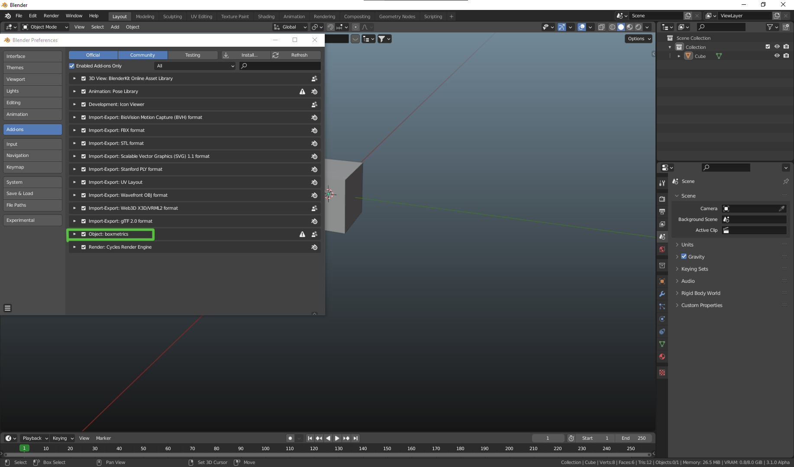

# BoxMetric

>### Table of Context
+ Features
+ <a href="#require">Requirements</a>
+ <a href="#install">Installation</a>
+ <a href="#use">Usage</a>
+ <a href="#faq">FAQ's</a>
+ <a href="#issues">known Issues</a>
+ <a href="#contact">get in touch</a>

#

 

>### Features

 

_*a Blender Toolkit to optimize Blender's UI*_

_**do to**_

#

>### Requirements <a href="#top" style="font-size:12px">to top</a>

 

A copy of [Blender](https://www.blender.org/download/) v2.80 or higher

#

>### Installation <a href="#top" style="font-size:12px">to top</a>

 

+ download [boxmetric.zip]() or clone this repository
+ open up your Blender Solution and navigate to the preferences
 
___Menu > Edit > Preferences___
+ in the opened Panel navigate to the **Addons** tab on the left hand site.
+ in the upper right corner, click on the button **"install"**
+ in the upcoming folder dialog, navigate to the folder where you have stored [boxmetric]() in
+ select either the _boxmetric.zip_ or the _"\_\_init\_\_.py"_ and click on **Install Add-on**.
+ boxmetric is goint to be installed right away.
+ check the Status Message to verify the installation. __green msg = success | red msg = error__ 
+ after the installation the addon list will be filtered by boxmetric
+ you will see a tiny checkbox to the left of the addon's name, tick it to activate the addon.
+ a click on the arrow right beside the checkbox will expand the addon-panel  to give access to the addon-settings. Here you can customize the addon to your liking.

#

>### Usage <a href="#top" style="font-size:12px">to top</a>

BoxMetric uses a Pie-Menu what can be access via `ctrl + y` by default. 
The Pie-Menu works in any viewport and regardless of mode (object|edit). 
You can choose from 3 tabs to either
+ add Primitive
+ switch viewport
+ switch workspace

Simply move the mouse over the pill of your choice. The underlaying Sub-Menu will appear right away. 
Navigate to the item of your choice and after a last `left mouse` click on the item, 
the choosen feature is going to be executed in the viewport the Pie-Menu was called from.

To activate the Object Panel and all its Features you have to be in **OBJECT**- mode. 
Move the mouse cursor above any **MESH**- Object and double-click it with your `left mouse` button. It doesn't matter if the choosen object is the current active or selected object. The Object that calls the event becomes the active/ selected object anyhow. 
Only if the object is of a proper kind the Object-Panel will show up and you get access. 

You can left-click-hold on the Panel's background to drag it around. 
You can click, you can use slider/tabs/buttons etc. the Panel will stay active. 

#

>### FAQ <a href="#top" style="font-size:12px">to top</a>

 

+ reset to default Viewport, when the viewport had been split 
+ reorder Elements of the Object-Panel
+ add/ reorder Elements to mirror Blender's properties at best
+ stress testing
+ possible additional features

#

>### Known Issues <a href="#top" style="font-size:12px;">to top</a>

* abnormal loadtime on nested objects with unapplied bevel/subdiv modifier
* in certain situation the raycast goes through the object and hits the object behind

#

>### Contact <a href="#top" width="12px">to top</a>

|  |  |
| --- | -------|
| Email | - |
| Discord | - |
| Homepage | - |

#

