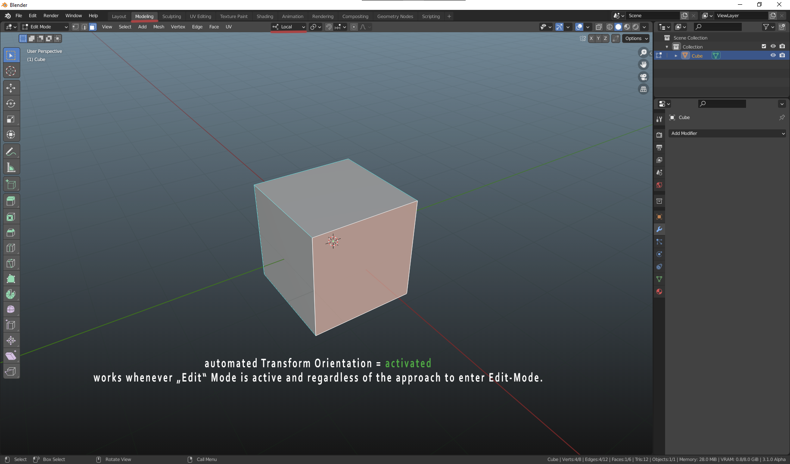
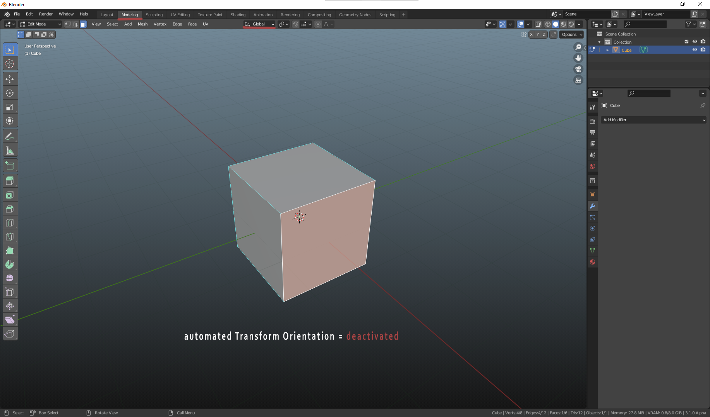
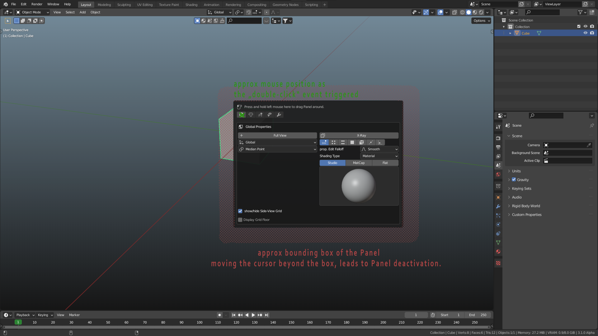
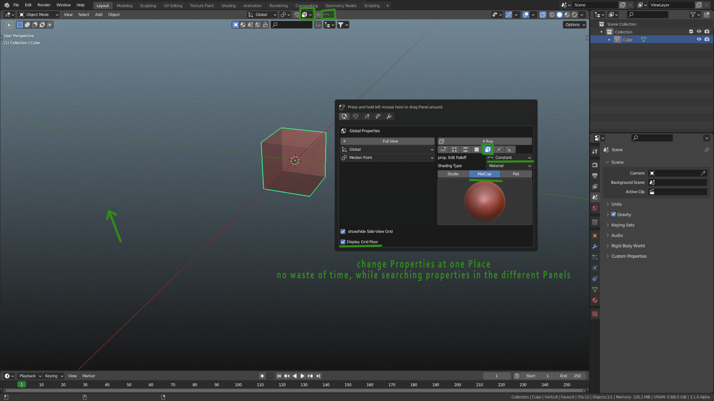
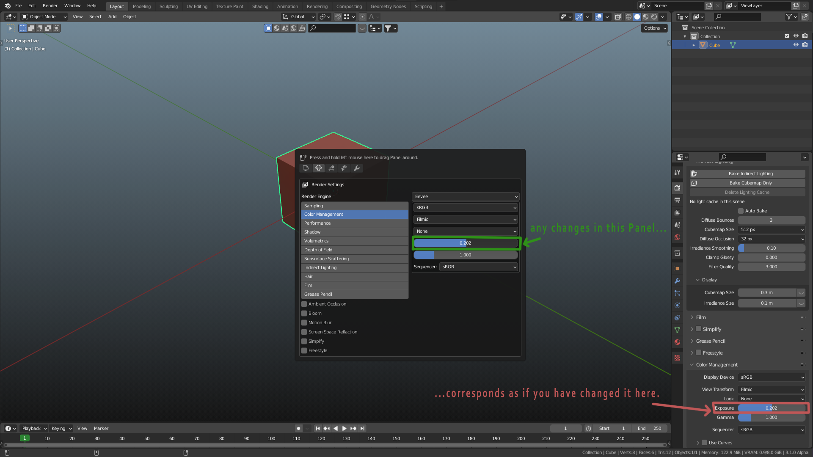
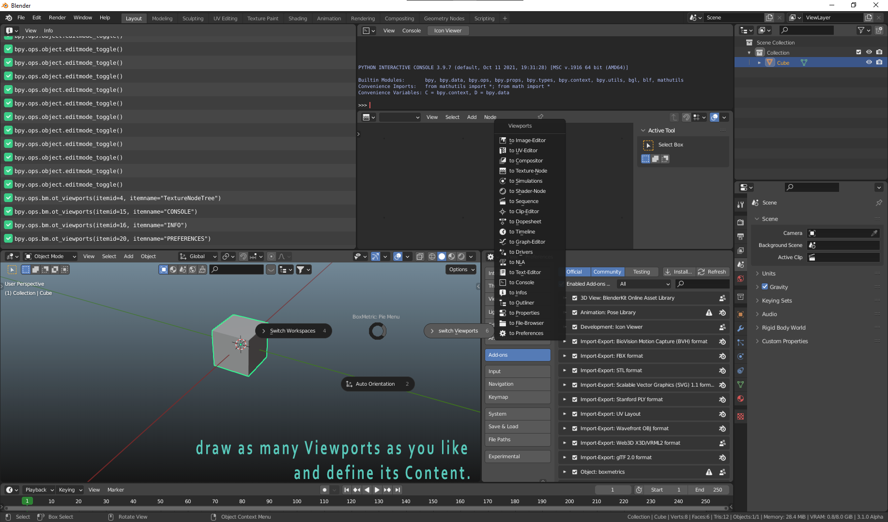
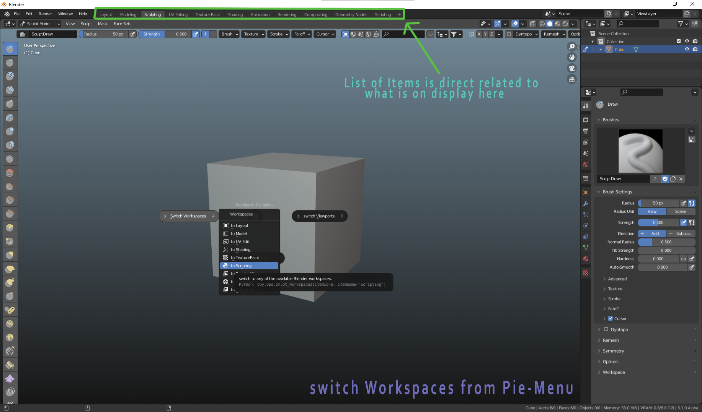

# BoxMetric

>## Table of Context
>+ Features
>+ <a href="#require">Requirements</a>
>+ <a href="#install">Installation</a>
>+ <a href="#use">Usage</a>
>+ <a href="#faq">FAQ's</a>
>+ <a href="#issues">known Issues</a>
>+ <a href="#contact">get in touch</a>
>+ <a href="#screenshots">Screenshots</a>

#

 

>## Features

 

* runs on native Blender
* let Blender decide how to calculate pivot axes by toggle on _**auto Orientation**_.  Blender will switch **transform Orientation** to _local_, everytime **Edit-Mode** has entered
* split the viewport and switch to any of the awailable Viewports using the **Pie-Menu**
* switch to any Workspace from **Pie-Menu**
* When in **OBJECT-Mode** and _double-click_ on any **MESH-Object**  you will get a Panel being drawn within the Viewport that contains all kind of useful Properties  which are related to the given Obejct. _see the [manual](docs/manual.md) for further Information._

#

>## Requirements <a href="#top" style="font-size:12px">to top</a>

 

+ A copy of [Blender](https://www.blender.org/download/) v2.80 or higher
+ no other Addons required
+ no third-party software required

#

>## Installation <a href="#top" style="font-size:12px">to top</a>

 

+ download [boxmetric.zip]() or clone this repository
+ open up your Blender Solution and navigate to the preferences
 
___Menu > Edit > Preferences___
+ in the opened Panel navigate to the **Addons** tab on the left hand site.
+ in the upper right corner, click on the button **"install"**
+ in the upcoming folder dialog, navigate to the folder where you have stored [boxmetric]() in
+ select either the _boxmetric.zip_ or the _"\_\_init\_\_.py"_ and click on **Install Add-on**.
+ boxmetric is goint to be installed right away.
+ check the Status Message to verify the installation. __green msg = success | red msg = error__ 
+ after the installation the addon list will be filtered by boxmetric
+ you will see a tiny checkbox to the left of the addon's name, tick it to activate the addon.
+ a click on the arrow right beside the checkbox will expand the addon-panel  to give access to the addon-settings. Here you can customize the addon to your liking.

#

>## Usage <a href="#top" style="font-size:12px">to top</a>

+ `Pie-Menu`: use _Ctrl+Y_ or your bound key in any Viewport to open BoxMetrix's Pie-Menu and pic any of its containing Elements: `(auto Orientation, switch Workspace, switch Viewport)`
+ `Panel`: only awailable in `Object-Mode` and on a Type `MESH-Object` selected.

    + `double-click` on a legit Object will

    + contains related Information about the selected Object
    + contains properties to manipulate the object or the Viewport in relation to the object.

#

>## FAQ <a href="#top" style="font-size:12px">to top</a>

#

`Can I use the Addon with any of the provided objects?`
- No, the Panel will only show up on a selected object of type of `MESH`.  i.e. _Cubes, Spheres, Cylinder, Planes etc.

`Will the Addon affect Blender's performance in any way?`
- No.

#

>## Known Issues <a href="#top" style="font-size:12px;">to top</a>

* abnormal loadtime on nested objects with unapplied bevel/subdiv modifier
* in certain situation the raycast goes through the object and hits the object behind

#

>## Contact <a href="#top" width="12px">to top</a>

|  |  |
| --- | -------|
| Email | - |
| Discord | - |
| Homepage | - |

#

>## Screenshot <a href="#top">to top</a>

| | |
| - | - |
|  | Preferences View |
|  | auto Transform Orientation activated |
|  | auto Transform Orientation deactivated |
|  | Panel after double click |
|  | some altered Properties |
|  | Blender Properties altered in Panel |
|  | a couple viewports drawn and its content changed from Pie-Menu only |
|  | switched workspaces from Pie-Menu only |
